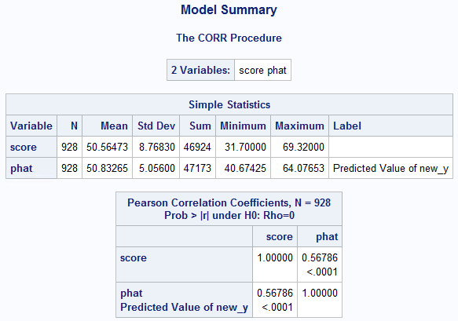

# Student Test Score Prediction with Linear Regression
**Author:** Giorgos Tzimas  
**Date:** June 2023  

## Table of Contents
- [Introduction](#introduction)
- [Dataset Description](#dataset-description)
- [Data Cleaning and Transformation](#data-cleaning-and-transformation)
- [Exploratory Data Analysis](#exploratory-data-analysis)
- [Building the Linear Regression Model](#building-the-linear-regression-model)
- [Final Model](#final-model)
- [Training and Testing](#training-and-testing)

## Introduction
Using a cross-sectional dataset from the High School and Beyond survey conducted by the Department of Education in 1980, we aim to predict students' test scores based on various demographic, familial, and educational features. Two linear regression models are built using the adjusted R-Squared method, one including interaction terms.

## Dataset Description
### Background
The dataset contains cross-sectional data from the High School and Beyond survey conducted by the Department of Education in 1980. The data was collected to study the relationship between early high school experiences and students' educational experiences in high school and after, as well as the effects of family, community, school, and classroom factors on student performance.

For further information: [High School and Beyond Survey](https://nces.ed.gov/surveys/hsb/)

### Observations and Attributes
The dataset comprises 4,739 entries with 15 distinct features.

### Data Types
Out of the 15 features in the dataset:
- 8 are of type "object" or text
- 2 are of type "integer"
- 5 are of type "float"

## Data Cleaning and Transformation
### Missing Values
None of the records or features in the dataset contain any missing values.

### One-Hot Encoding (Dummy Coding)
All categorical variables in the dataset are one-hot encoded into numeric variables with `n-1` columns (n = number of levels).

- `n_gender`: 1 if "male," 0 if "female."
- `n_ethnicity_hispanic`: 1 if "hispanic," 0 otherwise.
- `n_ethnicity_afam`: 1 if "afam," 0 otherwise.
- `n_fcollege`: 1 if "yes," 0 if "no."
- `n_mcollege`: 1 if "yes," 0 if "no."
- `n_home`: 1 if "yes," 0 if "no."
- `n_urban`: 1 if "yes," 0 if "no."
- `n_region`: 1 if "west," 0 if "other."

## Exploratory Data Analysis
### Correlation Matrix

**Observations:**
- None of the independent variables are strongly correlated with each other, suggesting multicollinearity might not be an issue.
- The feature with the strongest correlation to the dependent variable (score) is education (0.46).
- The second strongest correlated variable with score is `n_ethnicity_afam` (-0.28).

### Distribution of "score"

**Observations:**
- The dependent variable is normally distributed with a negligible skewness of -0.03.
- The mean score for all students is 50.89.
- The standard deviation for student score is 8.7.
- The lowest score is 28.95, and the largest is 72.81.

### Distribution of "unemp"

**Observations:**
- The county unemployment rate is right-tailed with a skewness of 1.56.
- The mean unemployment rate is 7.60, and the median is 7.1.
- The standard deviation is 2.76.
- This distribution's right-skewness is due to potential outliers.

### Distribution of "ln_unemp"

**Observations:**
- The right-tailed nature of the original variable is mitigated by taking its natural logarithm, with a new skew of 0.02.

### Distribution of "wage"

**Observations:**
- The hourly manufacturing wage is approximately normally distributed with a skewness of 0.09.
- The mean wage is 9.50, and the median is 9.68.

### Distribution of "distance"

**Observations:**
- Distance from college in 10 miles is heavily right-tailed with a skewness of 3.00.
- The right-skewness is due to potential outlier values in the [8.5, 20] range.

### Distribution of "ln_distance"

**Observations:**
- The right-tailed nature of the original variable is mitigated by taking its natural logarithm, with a new skew of -0.14.

### Distribution of "tuition"

**Observations:**
- Four-year college tuition in \$1000 is approximately normally distributed with a skewness of -0.15.

### Distribution of "score" by Gender

### Distribution of "score" by Ethnicity

### Distribution of "score" by Father's Graduation Status

### Distribution of "score" by Mother's Graduation Status

### Distribution of "score" by Home Ownership

### Distribution of "score" by School Location

### Distribution of "score" by Income Category

## Building the Linear Regression Model
### Model 1: Adjusted R-Squared Method
A linear regression model with 13 features and the highest adjusted R-Squared value.

**Observations:**
- F-Statistic: 181.58, p-value < .0001.
- Adjusted R-Squared: 0.3358.
- RMSE: 7.07930.
- All features are statistically significant.

### Model 2: Adjusted R-Squared Method with Interaction Terms
A linear regression model with interaction terms, including gender and education.

**Observations:**
- F-Statistic: 182.53, p-value < .0001.
- Adjusted R-Squared: 0.3369.
- RMSE: 7.0730.
- Interaction term `n_gender_education` is significant (p-value < .05).

## Final Model
After comparing both models on different metrics, Model 2 performs slightly better. Outliers and influential points were removed, and the final model includes 11 predictors.

**Observations:**
- F-Statistic: 218.34, p-value < .0001.
- Adjusted R-Squared: 0.34.
- RMSE: 7.04783.

### Parameter Estimates
- `n_gender`: Student score decreases by 4.77% when the student is male.
- `n_ethnicity_hispanic`: Student score decreases by 3.76% when the student is Hispanic.
- `n_ethnicity_afam`: Student score decreases by 6.63% when the student is African American.
- `n_fcollege`: Student scores increase by 1.22% when the father is a graduate.
- `n_mcollege`: Student scores increase by 1.04% when the mother is a graduate.
- `ln_distance`: Student score decreases by 34% for each additional 10 miles in distance.

## Training and Testing
The dataset is split into 80% training and 20% testing randomly.

### Training Results

**Observations:**
- F-Statistic: 177.87, p-value < .0001.
- Adjusted R-Squared: 0.3439.
- RMSE: 7.00805.

### Testing Results

**Observations:**
- RMSE: 7.21779.
- Adjusted R-Squared: 0.3225.

## Testing Model on New Records
After training and testing the model on the previous dataset, new records were created to evaluate model performance on unseen data.

**Predictions:**
- Obs. 1: Predicted = 45.6744, CI = [31.8976, 59.4511].
- Obs. 2: Predicted = 37.8967, CI = [24.1197, 51.6736].
- Obs. 3: Predicted = 41.2216, CI = [27.4524, 54.9908].