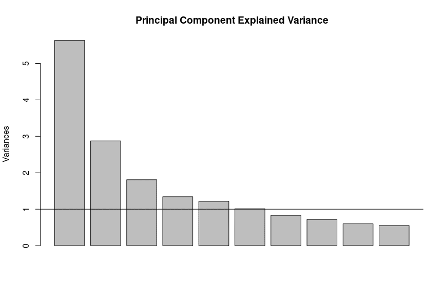

# The World and Life Expectancy: Analyzing the Impact on Country Development Status

**Authors:**  
Mai Ngo, Nasir Ahmed, Doug Oberman, Jenish Dobariya, George Tzimas, Peter Spedale  
**Date:** August 2023  

## Table of Contents
- [Executive Summary](#executive-summary)
- [Abstract](#abstract)
- [Methods](#methods)
- [Discussion and Results](#discussion-and-results)
- [Conclusion](#conclusion)
- [Appendices](#appendices)
  - [Appendix A: Tables](#appendix-a-tables)
  - [Appendix B: Figures](#appendix-b-figures)

## Executive Summary
How did the world’s life expectancy increase? Before the 1870s, the world was a more agrarian society with limited public health policies. The Industrial Revolution split the world into developed and developing countries. Developed countries exponentially increased their life expectancy, while developing countries fell behind.

**Important Findings:**
- Developing countries have increased their life expectancy exponentially since World War II.
- The World Health Organization (WHO) standardized international healthcare standards in 2000, helping developing nations improve healthcare practices.

**Study Approach:**
- A logistic regression analysis was conducted to measure a country’s development status.
- Linear regression analyses were done to understand the different factors impacting life expectancy between developed and developing countries.
- Other analyses included Correspondence Analysis (CA), Principal Component Analysis (PCA), Factor Analysis (FA), and Canonical Correlation Analysis (CCA).

**Key Results:**
- Logistic Regression Analysis:
  - Significant attributes included life expectancy, alcohol consumption, GDP per capita, and immunization.
  - Countries with life expectancies above 79 years are more likely to be developed.

- Linear Regression Analysis:
  - Developed nations have a smaller set of significant predictors.
  - Shared significant predictor: adult mortality rate.

- Correspondence Analysis:
  - A strong relationship exists between BMI and development status.

- PCA and FA:
  - Three key components emerged: Personal/Socioeconomic Resources, Immunization, and Population Growth.

- CCA:
  - Immunizations matter most for developing countries.
  - Developing countries need tailored strategies.

## Abstract
This study explores the relationship between life expectancy and the development status of a country using five distinct methodologies:
- **Logistic Regression**: Distinguishes developed and developing countries based on life expectancy.
- **Linear Regression**: Identifies factors influencing life expectancy for both developed and developing nations.
- **Correspondence Analysis (CA)**: Investigates the correlation between average BMI and development status.
- **Principal Component Analysis (PCA) and Factor Analysis (FA)**: Consolidate variables to explain life expectancy.
- **Canonical Correlation Analysis (CCA)**: Determines the most influential factors affecting life expectancy.

## Methods
### Logistic Regression
- **Objective**: Differentiate between developed and developing countries based on life expectancy.
- **Approach**:
  - 70/30 train-test split ratio.
  - Grouped attributes into socioeconomics, mortality, health development, and immunization.
  - Seven logistic models were created.

### Linear Regression
- **Objective**: Assess whether a country's development status affects life expectancy.
- **Approach**:
  - A Box-Cox transformation was applied to maintain linear regression assumptions.
  - Data split into developed and developing groups.

### Correspondence Analysis (CA)
- **Objective**: Investigate the relationship between BMI and development status.
- **Approach**:
  - Created contingency tables for 2000 and 2015.
  - Analyzed patterns and associations between development status and BMI categories.

### Principal Component Analysis (PCA) and Factor Analysis (FA)
- **Objective**: Group factors logically to focus on improving life expectancy.
- **Approach**:
  - **PCA**: Scree plot used to determine the number of components.
  - **FA**: Used VARIMAX rotation and conducted validity tests (KMO, Bartlett’s Test, Cronbach’s Alpha).

### Canonical Correlation Analysis (CCA)
- **Objective**: Identify the most influential factors on life expectancy.
- **Approach**:
  - PCA/FA groupings used as x variates vs. life expectancy/population y variate.
  - Split data into developed and developing groups.

## Discussion and Results
### Logistic Regression
- **Model Results**:
  - Positive relationships: life expectancy, alcohol consumption, GDP per capita, polio immunization.
  - Negative relationships: prevalence of thinness, adult mortality.
  - AUC value: 0.9761.
  - Model accuracy: 94.25%.

### Linear Regression
- **Key Findings**:
  - Developed countries: Significant factors include adult mortality rate, alcohol consumption, prevalence of thinness, GDP per capita, and population size.
  - Developing countries: Significant factors include infant death rate, GDP spent on healthcare, measles cases, BMI, healthcare expenditure, diphtheria immunization, and HIV/AIDS deaths.

### Correspondence Analysis (CA)
- A strong relationship exists between BMI and development status.

### PCA and FA
- **Components**:
  - Component 1: Personal and Socioeconomic Factors (e.g., alcohol, BMI, schooling, GDP).
  - Component 2: Causes of Death (e.g., infant deaths, under-five deaths, measles).
  - Component 3: Immunizations (e.g., polio, diphtheria, hepatitis B).

### Canonical Correlation Analysis (CCA)
- **Results**:
  - Developing countries: Immunizations (polio, diphtheria, hepatitis B) show a correlation with life expectancy.

## Conclusion
**Main Takeaways:**
- A country's development status matters significantly for life expectancy.
- Developing and developed nations require tailored strategies.
- Immunization matters most in the early years.
- Investing in economic status and education yields long-term health benefits.

**Future Work:**
- More data is needed, especially for developed countries.
- Investigate additional measures like quality of life and happiness.
- Refine methodologies for future research.

## Appendices

### Appendix A: Tables
  
  
  
  

### Appendix B: Figures
  
  
  
  
  
  
  

## References
- [Roser, Max. "Life expectancy".](https://ourworldindata.org/life-expectancy)  
- Griffin, Patrick M., et al. *The Changing Epidemiology of Hepatitis A in the United States*.  
- Galvin, John F. *Focus on Life Expectancy*.