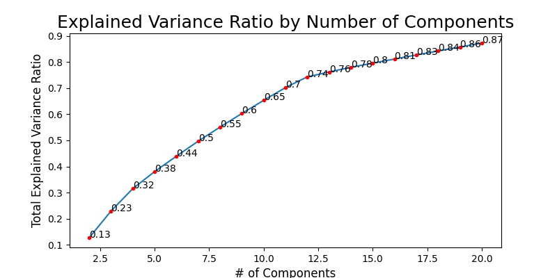

<!-- # Predicting Fraudulent Transactions Using Binary Classification Algorithms

**Team Member:** Giorgos Tzimas  
**Date:** May 2023  

## Abstract
Using customers’ transactional dataset, we built two supervised machine learning algorithms, Logistic Regression and Random Forest, to classify each instance as either a fraudulent or non-fraudulent transaction. After comparing the performance of both models on important metrics such as recall and False Positive Rate, we picked Random Forest as the final binary classification model to be used.

## Table of Contents
- [Dataset Description](#dataset-description)
  - [Background](#background)
  - [Observations and Attributes](#observations-and-attributes)
  - [Data Types](#data-types)
- [Data Cleaning](#data-cleaning)
- [Feature Extraction](#feature-extraction)
- [Exploratory Data Analysis](#exploratory-data-analysis)
  - [Total Counts by Fraud Status](#total-counts-by-fraud-status)
  - [Numeric Feature Distribution](#numeric-feature-distribution)
  - [Numeric Feature Boxplot by Fraud Status](#numeric-feature-boxplot-by-fraud-status)
  - [Transaction Amount by Fraud Status](#transaction-amount-by-fraud-status)
  - [Transactions by Country](#transactions-by-country)
  - [Fraudulent Transaction Amount by Country](#fraudulent-transaction-amount-by-country)
  - [Transactions by Card Presence](#transactions-by-card-presence)
  - [Top 20 Brands by Transaction Count](#top-20-brands-by-transaction-count)
  - [Top 20 Brands by Fraudulent Transaction Count](#top-20-brands-by-fraudulent-transaction-count)
  - [Top 20 Brands by Average Fraudulent Transaction Amount](#top-20-brands-by-average-fraudulent-transaction-amount)
- [Unsupervised Learning](#unsupervised-learning)
  - [Dimensionality Reduction: Singular Value Decomposition](#dimensionality-reduction-singular-value-decomposition)
  - [Clustering: KMeans](#clustering-kmeans)
- [Supervised Learning](#supervised-learning)
  - [Dataset Resampling](#dataset-resampling)
  - [Hyperparameter Tuning](#hyperparameter-tuning)
  - [Logistic Regression](#logistic-regression)
    - [Feature Importances](#logistic-regression-feature-importances)
  - [Random Forest](#random-forest)
    - [Feature Importances](#random-forest-feature-importances)
- [Model Comparison](#model-comparison)
- [References](#references) -->

# Predicting Fraudulent Transactions Using Binary Classification Algorithms

**Team Member:** Giorgos Tzimas  
**Date:** May 2023  

## Abstract
Using customers’ transactional dataset, we built two supervised machine learning algorithms, Logistic Regression and Random Forest, to classify each instance as either a fraudulent or non-fraudulent transaction. After comparing the performance of both models on important metrics such as recall and False Positive Rate, we picked Random Forest as the final binary classification model to be used.

## Table of Contents
- [Dataset Description](#dataset-description)
  - [Background](#background)
  - [Observations and Attributes](#observations-and-attributes)
  - [Data Types](#data-types)
- [Data Cleaning](#data-cleaning)
- [Feature Extraction](#feature-extraction)
- [Exploratory Data Analysis](#exploratory-data-analysis)
  - [Total Counts by Fraud Status](#total-counts-by-fraud-status)
  - [Numeric Feature Distribution](#numeric-feature-distribution)
  - [Numeric Feature Boxplot by Fraud Status](#numeric-feature-boxplot-by-fraud-status)
  - [Transaction Amount by Fraud Status](#transaction-amount-by-fraud-status)
  - [Transactions by Country](#transactions-by-country)
  - [Fraudulent Transaction Amount by Country](#fraudulent-transaction-amount-by-country)
  - [Transactions by Card Presence](#transactions-by-card-presence)
  - [Top 20 Brands by Transaction Count](#top-20-brands-by-transaction-count)
  - [Top 20 Brands by Fraudulent Transaction Count](#top-20-brands-by-fraudulent-transaction-count)
  - [Top 20 Brands by Average Fraudulent Transaction Amount](#top-20-brands-by-average-fraudulent-transaction-amount)
- [Unsupervised Learning](#unsupervised-learning)
  - [Dimensionality Reduction: Singular Value Decomposition](#dimensionality-reduction-singular-value-decomposition)
  - [Clustering: KMeans](#clustering-kmeans)
- [Supervised Learning](#supervised-learning)
  - [Dataset Resampling](#dataset-resampling)
  - [Hyperparameter Tuning](#hyperparameter-tuning)
  - [Logistic Regression](#logistic-regression)
    - [Feature Importances](#logistic-regression-feature-importances)
  - [Random Forest](#random-forest)
    - [Feature Importances](#random-forest-feature-importances)
- [Model Comparison](#model-comparison)
- [References](#references)

## Dataset Description
### Background
The panel dataset contains commercial customers’ financial information and a "days past due" indicator from 2000 to 2020, provided by the Capital One Data Scientist Recruiting process.

**Dataset Link:** [Capital One Recruiting - Data Scientist Dataset](https://github.com/CapitalOneRecruiting/DS)

### Observations and Attributes
The dataset comprises a comprehensive collection of 786,363 entries, encompassing 29 distinct features. These features contain a range of information pertaining to both the customer and the transactional context. Customer-related attributes include identifiers, credit card balance, credit limit, and more. Similarly, business-related attributes encompass details like business name, category, and point-of-sale information.

### Data Types
Out of the 29 features in the dataset:
- 17 are of type "object" or text
- 6 are of type "integer"
- 3 are of type "float"
- 3 are of type "boolean"

| Type              | Attribute                |
|-------------------|--------------------------|
| int64             | accountNumber, customerId, creditLimit, cardCVV, enteredCVV, cardLast4Digits |
| float64           | availableMoney, transactionAmount, currentBalance   |
| object            | transactionDateTime, merchantName, acqCountry, merchantCountryCode, posEntryMode, posConditionCode, merchantCategoryCode, currentExpDate, accountOpenDate, dateOfLastAddressChange, transactionType, echoBuffer, merchantCity, merchantState, merchantZip, brandName  |
| bool              | cardPresent, expirationDateKeyInMatch, isFraud      |

## Data Cleaning
Some of the features are missing values either due to not being entered or because the feature contains sensitive information. Features like `recurringAuthInd`, `posOnPremises`, `merchantZip`, `merchantState`, `merchantCity`, and `echoBuffer` are removed from the dataset. The remaining features with missing values are imputed using a "most frequent" approach due to their categorical nature.

| Feature            | Missing Count |
|--------------------|---------------|
| recurringAuthInd   | 786,363       |
| posOnPremises      | 786,363       |
| merchantZip        | 786,363       |
| merchantState      | 786,363       |
| merchantCity       | 786,363       |
| echoBuffer         | 786,363       |
| acqCountry         | 4,562         |
| posEntryMode       | 4,054         |
| merchantCountryCode| 724           |
| transactionType    | 698           |
| posConditionCode   | 409           |

## Feature Extraction
### Transactional Information
We extracted transactional information from datetime features such as `transactionDateTime`, `accountOpenDate`, and `dateOfLastAddressChange`.

From `transactionDateTime`, we extracted the month, day, and hour:
| transactionDateTime     | trans_month | trans_day_name | trans_hour |
|-------------------------|-------------|----------------|------------|
| 2016-08-13 14:27:32     | 8           | Saturday       | 14         |
| 2016-10-11 05:05:54     | 10          | Tuesday        | 05         |

Similarly, we extracted month and year from the `currentExpDate` feature:
| currentExpDate          | exp_month   | exp_year       |
|-------------------------|-------------|----------------|
| 2023-06-01 00:00:00     | 6           | 2023          |

### Date Differences
We also extracted date differences in days from each datetime feature.

| transactionDateTime     | accountOpenDate        | trans_day_open_date_diff |
|-------------------------|------------------------|--------------------------|
| 2016-08-13 14:27:32     | 2015-03-14 00:00:00    | 518                      |

### Other Features
- **Matching CVV Code:** A boolean feature indicating whether the credit card's CVV code matched the entered CVV.
- **Brand Name:** Extracted brand names from the merchant feature.

## Exploratory Data Analysis
### Total Counts by Fraud Status
Approximately 98% of the records are non-fraudulent. This large dataset imbalance may heavily skew the model results.

### Numeric Feature Distribution
All of the numerical features have a right-skewed distribution. Some extreme values may be outliers, but it's possible they are valid due to the scale difference between fraudulent and non-fraudulent transactions.

### Numeric Feature Boxplot by Fraud Status
The largest difference in numeric feature distributions grouped by fraud status is visible for transaction amounts.

### Transaction Amount by Fraud Status
The median transaction amount for fraudulent transactions is approximately $176, whereas non-fraudulent transactions have a median of $86.

### Transactions by Country
Approximately 99% of the transactions occur in the United States.

### Fraudulent Transaction Amount by Country
Canada has the largest median fraudulent transaction amount ($229), followed by Puerto Rico ($198) and the United States ($176).

### Transactions by Card Presence
There is a significant difference in transaction counts by card presence when grouped by fraud status.

### Top 20 Brands by Transaction Count
The brand with the most transactions is AMC with 37,942 total transactions.

### Top 20 Brands by Fraudulent Transaction Count
The brand with the most fraudulent transactions is Lyft with 760 total transactions.

### Top 20 Brands by Average Fraudulent Transaction Amount
Marriott Hotels has the largest average fraudulent transaction amount at $444.10.

## Unsupervised Learning
### Dimensionality Reduction: Singular Value Decomposition
Our preprocessed and transformed dataset has a total of 266 features. We reduced this to only 12 features using `TruncatedSVD`.

### Clustering: KMeans
With our reduced dataset, we used KMeans clustering to group the data points. We chose 4 clusters.

## Supervised Learning
### Dataset Resampling
Due to the drastic imbalance in our dependent variable, we used an under-sampling method to create a balanced dataset.

| Fraud Status      | Original       | Under-Sampled  |
|-------------------|----------------|----------------|
| False             | 773,946       | 12,417        |
| True              | 12,417        | 12,417        |

### Hyperparameter Tuning
We used `GridSearchCV` to tune hyperparameters for both the Logistic Regression and Random Forest models.

**Logistic Regression:**
| Parameter          | Value         |
|--------------------|---------------|
| C                  | 0.5           |
| penalty            | l1            |
| solver             | saga          |
| max_iter           | 500           |

**Random Forest:**
| Parameter          | Value         |
|--------------------|---------------|
| n_estimators       | 100           |
| criterion          | gini          |
| max_depth          | 5             |
| min_samples_leaf   | 4             |

### Logistic Regression
#### Feature Importances

### Random Forest
#### Feature Importances

## Model Comparison
Out of the two classification models, Random Forest had better performance with a recall score of 0.715137 and a False Positive Rate of 0.332624.

## References
1. [Capital One Data Scientist Recruiting](https://github.com/CapitalOneRecruiting/DS)

