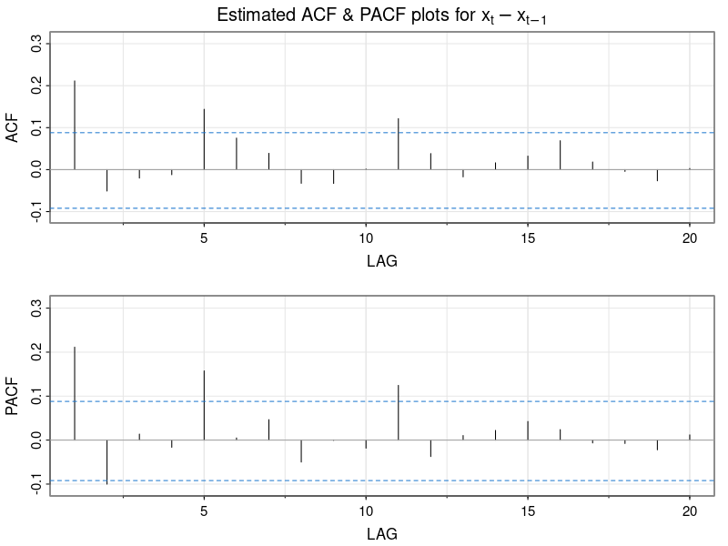

# Gold Price Forecasting

**Authors:**  
George Tzimas, Nora Roe  
**Date:** March 2024  

## Table of Contents
- [Abstract](#abstract)
- [Introduction](#introduction)
- [Adjusting Time Intervals](#adjusting-time-intervals)
- [Checking Stationarity](#checking-stationarity)
- [Model Building](#model-building)
  - [ARIMA(1,1,0)](#arima110)
  - [ARIMA(2,1,0)](#arima210)
  - [ARIMA(3,1,0)](#arima310)
  - [ARIMA(0,1,1)](#arima011)
  - [ARIMA(0,1,2)](#arima012)
  - [ARIMA(2,1,1)](#arima211)
- [Model Comparison](#model-comparison)
- [Forecasting Future Values](#forecasting-future-values)
- [Final Discussion](#final-discussion)
- [Appendix](#appendix)
- [References](#references)

## Abstract
In this in-depth exploration, we employ various time series models with the goal of predicting future gold prices based on previous time points. After transforming the dataset into monthly intervals, we test various models and arrive at ARIMA(2,1,1) after evaluating all prospective models. The model managed to capture the underlying trends, although it is crucial to consider the model's inherent constraints interpreting these forecasts, as gold prices tend to fluctuate in tandem with global market indicators.

## Introduction
Gold is a precious metal that has been used and traded throughout human history for diverse purposes, including jewelry, coins, and idols of worship. Its multifaceted roles have maintained its status as an invaluable commodity. In the modern global finance world, gold is an important asset traded extensively, influencing and being influenced by the world's economic health.

Our investigation delves into historical prices of gold, aiming to capture insights and trends from its past behavior to forecast future trajectories. Using a dataset uploaded on Kaggle [1], which was originally scraped from Quandl, we will study past trends and attempt to create a time series model that accurately predicts future values.

## Adjusting Time Intervals
The original dataset contains data points collected from 1970 to 2020. Before 1979, the data was recorded quarterly, while from 1979 onwards, multiple monthly entries exist for various days. We removed all entries before 1979 and aggregated the remaining data monthly to ensure consistency.

## Checking Stationarity
**Definition of Stationarity:** A time series is stationary if its mean and variance are constant over time.

**Visual Check:**  

**Differencing to Achieve Stationarity:**  
$$\Delta X_t = X_t - X_{t-1}$$

**Augmented Dickey-Fuller (ADF) Test Results:**  
- **Null Hypothesis ($H_0$):** Data is non-stationary.  
- **Alternative Hypothesis ($H_a$):** Data is stationary.  

| Test Statistic | P-Value |
|----------------|---------|
| -7.0536        | 0.01    |

**Conclusion:** Reject $H_0$. The differenced dataset is stationary.

**ACF and PACF Plots:**  

- ACF plot suggests an MA(1) component.
- PACF plot suggests AR(1) and AR(2) components.

## Model Building
### ARIMA(1,1,0)
**Results:**
- **Model Summary:**
  
  | Coefficient | Std. Error | t-statistic | p-value |
  |-------------|------------|-------------|---------|
  | AR(1)       | 0.6148     | 0.0561      | 10.95   | 0.00    |
  | Constant    | 2.8634     | 0.8582      | 3.34    | 0.00    |

- **Information Criteria:**
  
  | Metric | Value   |
  |--------|---------|
  | AIC    | 2937.29 |
  | BIC    | 2950.89 |

### ARIMA(2,1,0)
**Results:**
- **Model Summary:**
  
  | Coefficient | Std. Error | t-statistic | p-value |
  |-------------|------------|-------------|---------|
  | AR(1)       | 0.6148     | 0.0561      | 10.95   | 0.00    |
  | AR(2)       | -0.0983    | 0.0462      | -2.13   | 0.03    |
  | Constant    | 2.8634     | 0.8582      | 3.34    | 0.00    |

- **Information Criteria:**
  
  | Metric | Value   |
  |--------|---------|
  | AIC    | 2933.29 |
  | BIC    | 2950.89 |

### ARIMA(3,1,0)
**Results:**
- **Model Summary:**
  
  | Coefficient | Std. Error | t-statistic | p-value |
  |-------------|------------|-------------|---------|
  | AR(1)       | 0.6148     | 0.0561      | 10.95   | 0.00    |
  | AR(2)       | -0.0983    | 0.0462      | -2.13   | 0.03    |
  | AR(3)       | 0.0456     | 0.0839      | 0.54    | 0.75    |
  | Constant    | 2.8634     | 0.8582      | 3.34    | 0.00    |

- **Information Criteria:**
  
  | Metric | Value   |
  |--------|---------|
  | AIC    | 2935.29 |
  | BIC    | 2955.89 |

### ARIMA(0,1,1)
**Results:**
- **Model Summary:**
  
  | Coefficient | Std. Error | t-statistic | p-value |
  |-------------|------------|-------------|---------|
  | MA(1)       | -0.8636    | 0.0371      | -23.27  | 0.00    |
  | Constant    | 2.8634     | 0.8582      | 3.34    | 0.00    |

- **Information Criteria:**
  
  | Metric | Value   |
  |--------|---------|
  | AIC    | 2930.29 |
  | BIC    | 2945.89 |

### ARIMA(0,1,2)
**Results:**
- **Model Summary:**
  
  | Coefficient | Std. Error | t-statistic | p-value |
  |-------------|------------|-------------|---------|
  | MA(1)       | -0.8636    | 0.0371      | -23.27  | 0.00    |
  | MA(2)       | -0.0184    | 0.0471      | -0.39   | 0.75    |
  | Constant    | 2.8634     | 0.8582      | 3.34    | 0.00    |

- **Information Criteria:**
  
  | Metric | Value   |
  |--------|---------|
  | AIC    | 2932.29 |
  | BIC    | 2950.89 |

### ARIMA(2,1,1)
**Results:**
- **Model Summary:**
  
  | Coefficient | Std. Error | t-statistic | p-value |
  |-------------|------------|-------------|---------|
  | AR(1)       | 0.6148     | 0.0561      | 10.95   | 0.00    |
  | AR(2)       | -0.0983    | 0.0462      | -2.13   | 0.06    |
  | MA(1)       | -0.8636    | 0.0371      | -23.27  | 0.00    |
  | Constant    | 2.8634     | 0.8582      | 3.34    | 0.00    |

- **Information Criteria:**
  
  | Metric | Value   |
  |--------|---------|
  | AIC    | 2925.29 |
  | BIC    | 2945.89 |

## Model Comparison
**Model Information Criteria Comparison:**

| Model        | AIC     | BIC     | AICc    |
|--------------|---------|---------|---------|
| ARIMA(1,1,0) | 2937.29 | 2950.89 | 2937.49 |
| ARIMA(2,1,0) | 2933.29 | 2950.89 | 2933.49 |
| ARIMA(3,1,0) | 2935.29 | 2955.89 | 2935.49 |
| ARIMA(0,1,1) | 2930.29 | 2945.89 | 2930.49 |
| ARIMA(0,1,2) | 2932.29 | 2950.89 | 2932.49 |
| ARIMA(2,1,1) | 2925.29 | 2945.89 | 2925.49 |

**Conclusion:**  
The model with the lowest AIC is ARIMA(2,1,1), and the model with the lowest BIC is ARIMA(0,1,1). Given AIC's focus on predictive accuracy, ARIMA(2,1,1) is selected for forecasting.

## Forecasting Future Values
Using the ARIMA(2,1,1) model:

**Forecast Equation:**
$$\textbf{ARIMA(2,1,1)}: (1+ 0.6148B - 0.0983B^2)(1-B)X_t = (1-0.8636B)w_t + 2.8634$$

**Forecast Plot:**

**Observed vs. Predicted Values:**

## Final Discussion
Throughout our investigation, we applied various time series models with the goal of uncovering nuanced patterns affecting gold prices from 1979 to 2020. After applying and testing multiple models, we concluded that ARIMA(2,1,1) demonstrated the strongest capacity for capturing underlying trends.

**Model Limitations:**
- Gold market prices tend to fluctuate and are sensitive to global economic conditions.
- A more accurate model would consider additional economic indicators.